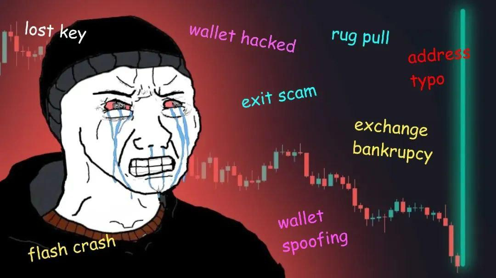

[](https://github.com/yyle88/gobtcsign/actions/workflows/release.yml?query=branch%3Amain)
[](https://pkg.go.dev/github.com/yyle88/gobtcsign)
[](https://coveralls.io/github/yyle88/gobtcsign?branch=main)
[](https://github.com/yyle88/gobtcsign)
[](https://github.com/yyle88/gobtcsign/releases)
[](https://goreportcard.com/report/github.com/yyle88/gobtcsign)

---

<p align="center">
  
</p>
<h3 align="center">golang-bitcoin</h3>
<p align="center">create/sign <code>bitcoin transaction</code> with golang</p>

# gobtcsign

`gobtcsign` is a concise and efficient Bitcoin transaction signing library designed to help developers quickly build, sign, and verify Bitcoin transactions.

`gobtcsign` is a Golang package that simplifies BTC/DOGECOIN transaction signing and serves as a gateway for developers to explore BTC blockchain knowledge.

---

<!-- TEMPLATE (EN) BEGIN: LANGUAGE NAVIGATION -->
## CHINESE README

[中文说明](README.zh.md)
<!-- TEMPLATE (EN) END: LANGUAGE NAVIGATION -->

---

## Installation

```bash
go get github.com/yyle88/gobtcsign
```

---

## Features

Here are the core features provided by `gobtcsign`:

1. **Transaction Construction**: Efficiently construct transactions with support for multiple inputs and outputs, including automatic change calculation. A dynamic fee adjustment feature allows users to control transaction costs.
2. **Transaction Size Estimation**: Estimate the virtual size (vSize) of transactions based on the number and type of inputs/outputs. This helps developers set appropriate fee rates based on real-time conditions.
3. **Transaction Signing**: Compatible with multiple address types, including P2PKH, P2SH, and SegWit. Developers can use private keys to sign transaction inputs.
4. **Signature Verification**: Ensure transaction signatures are valid, reducing the risk of rejection by the network due to signature issues.
5. **Transaction Serialization**: Serialize signed transactions into hexadecimal strings for direct broadcasting to the Bitcoin network.

---

## Dependencies

`gobtcsign` relies on the following key modules:

- **github.com/btcsuite/btcd**: Implements Bitcoin's core protocol and serves as the foundation for building and parsing transactions.
- **github.com/btcsuite/btcd/btcec/v2**: Handles elliptic curve cryptography for key management and signature generation/verification.
- **github.com/btcsuite/btcd/btcutil**: Provides utilities for encoding/decoding Bitcoin addresses and other common Bitcoin operations.
- **github.com/btcsuite/btcd/chaincfg/chainhash**: Offers hash calculations and chain-related utilities.
- **github.com/btcsuite/btcwallet/wallet/txauthor**: Constructs transaction inputs/outputs and automatically handles change.
- **github.com/btcsuite/btcwallet/wallet/txrules**: Defines transaction rules, including minimum fee calculations and other constraints.
- **github.com/btcsuite/btcwallet/wallet/txsizes**: Calculates the virtual size (vSize) of transactions, enabling dynamic fee adjustments.

`gobtcsign` avoids using packages outside the `github.com/btcsuite` suite. Even so, you should never use this library directly for signing transactions without careful review to avoid potential malicious code that could collect your private keys. The best practice is to **fork the project** or copy the relevant code into your project while thoroughly reviewing the code and configuring strict network whitelists for your servers.

---

## Usage Steps

1. **Initialize Transaction Parameters**: Define transaction inputs (UTXOs), output target addresses, and amounts. Configure Replace-By-Fee (RBF) options as needed.
2. **Estimate Transaction Size and Fees**: Use the library's methods to estimate transaction size and set appropriate fees based on real-time fee rates.
3. **Generate Unsigned Transactions**: Build transactions using the defined parameters.
4. **Sign Transactions**: Sign transaction inputs using the corresponding private keys.
5. **Validate and Serialize**: Verify the signature's validity and serialize the transaction into a hexadecimal string for broadcasting.

---

## Demos

### Demo 1: Create Bitcoin Wallet

This demo shows how to create a P2WPKH (SegWit) Bitcoin wallet, generate random private keys, and derive addresses.

```go
// Package main demonstrates P2WPKH wallet creation
// Generates random private key and derives P2WPKH (SegWit) address
// Outputs WIF and hex format private keys along with Bitcoin address
package main

import (
	"encoding/hex"
	"fmt"
	"log"

	"github.com/btcsuite/btcd/btcec/v2"
	"github.com/btcsuite/btcd/btcutil"
	"github.com/btcsuite/btcd/chaincfg"
)

func main() {
	netParams := &chaincfg.MainNetParams

	// Generate new random private key
	privateKey, err := btcec.NewPrivateKey()
	if err != nil {
		log.Fatalf("random private key error: %v", err)
	}

	// Encode private key in WIF (Wallet Import Format)
	privateWif, err := btcutil.NewWIF(privateKey, netParams, true)
	if err != nil {
		log.Fatalf("create wallet import format error: %v", err)
	}

	// Generate public key from private key
	pubKey := privateWif.PrivKey.PubKey()

	// Calculate public key hash (P2WPKH uses SHA256 + RIPEMD160 hash of public key)
	pubKeyHash := btcutil.Hash160(pubKey.SerializeCompressed())

	// Create P2WPKH address
	witnessPubKeyHash, err := btcutil.NewAddressWitnessPubKeyHash(pubKeyHash, netParams)
	if err != nil {
		log.Fatalf("create P2WPKH address error: %v", err)
	}

	fmt.Println("Private Key (WIF):", privateWif.String())
	fmt.Println("Private Key (Hex):", hex.EncodeToString(privateKey.Serialize()))
	fmt.Println("P2WPKH Address:", witnessPubKeyHash.EncodeAddress())
	fmt.Println("Network Name:", netParams.Name)
}
```

⬆️ **Source:** [Demo 1 Source Code](internal/demos/demo1x/main.go)

---

### Demo 2: Bitcoin Transaction Signing

This demo demonstrates signing a Bitcoin transaction on TestNet using P2WPKH (SegWit) addresses with RBF support.

```go
// Package main demonstrates Bitcoin transaction signing on TestNet
// Shows complete workflow: build transaction, sign, verify, and get hex output
// Uses P2WPKH (SegWit) address format with RBF support
package main

import (
	"fmt"

	"github.com/btcsuite/btcd/chaincfg"
	"github.com/yyle88/gobtcsign"
)

func main() {
	// TestNet sender address and private key
	// WARNING: Never expose private key unless wallet is disposable
	const senderAddress = "tb1qvg2jksxckt96cdv9g8v9psreaggdzsrlm6arap"
	const privateKeyHex = "54bb1426611226077889d63c65f4f1fa212bcb42c2141c81e0c5409324711092"

	netParams := chaincfg.TestNet3Params

	// Build transaction parameters with inputs and outputs
	param := gobtcsign.BitcoinTxParams{
		VinList: []gobtcsign.VinType{
			{
				OutPoint: *gobtcsign.MustNewOutPoint("e1f05d4ef10d6d4245839364c637cc37f429784883761668978645c67e723919", 2),
				Sender:   *gobtcsign.NewAddressTuple(senderAddress),
				Amount:   13089,
				RBFInfo:  *gobtcsign.NewRBFNotUse(),
			},
		},
		OutList: []gobtcsign.OutType{
			{
				Target: *gobtcsign.NewAddressTuple("tb1qk0z8zhsq5hlewplv0039smnz62r2ujscz6gqjx"),
				Amount: 1234,
			},
			{
				Target: *gobtcsign.NewAddressTuple(senderAddress),
				Amount: 11855 - 11111,
			},
		},
		RBFInfo: *gobtcsign.NewRBFActive(),
	}

	// Fee calculation depends on real-time rate and transaction size
	// Different transactions have different estimates, fee calculation skipped here
	mustSame(int64(11111), int64(param.GetFee()))

	// Estimate transaction size (slightly larger than actual value)
	size, err := param.EstimateTxSize(&netParams, gobtcsign.NewNoChange())
	mustDone(err)
	fmt.Println("estimate-tx-size:", size)

	// Create transaction ready to sign
	signParam, err := param.CreateTxSignParams(&netParams)
	mustDone(err)

	fmt.Println("utxo inputs:", len(signParam.InputOuts))

	// Sign the transaction with private key
	mustDone(gobtcsign.Sign(senderAddress, privateKeyHex, signParam))

	// Get signed transaction
	msgTx := signParam.MsgTx

	// Verify signature is valid
	mustDone(param.VerifyMsgTxSign(msgTx, &netParams))
	// Check transaction parameters match
	mustDone(param.CheckMsgTxParam(msgTx, &netParams))

	// Get transaction hash
	txHash := gobtcsign.GetTxHash(msgTx)
	fmt.Println("msg-tx-hash:->", txHash, "<-")
	mustSame("e587e4f65a7fa5dbba6bede6b000e8ece097671bb348db3de0e507c8b36469ad", txHash)

	// Serialize transaction to hex string
	signedHex, err := gobtcsign.CvtMsgTxToHex(msgTx)
	mustDone(err)
	fmt.Println("raw-tx-data:->", signedHex, "<-")
	mustSame("010000000001011939727ec645869768167683487829f437cc37c664938345426d0df14e5df0e10200000000fdffffff02d204000000000000160014b3c4715e00a5ff9707ec7be2586e62d286ae4a18e80200000000000016001462152b40d8b2cbac358541d850c079ea10d1407f02483045022100e8269080acc14fd24ee13cbbdaa5ea34192f090c917b4ca3da44eda25badd58e02206813da9023bebd556a95e04e6a55c9a5fdf5dfb19746c896d7fd7f26aaa58878012102407ea64d7a9e992028a94481af95ea7d8f54870bd73e5878a014da594335ba3200000000", signedHex)

	// SendRawHexTx(txHex) - Use this hex to broadcast transaction
	// Transaction already broadcasted, visible on chain

	// Common errors:
	// "-3: Amount is not a number or string" - Using btcjson.NewSendRawTransactionCmd instead of NewBitcoindSendRawTransactionCmd
	// "-26: mempool min fee not met" - Node minrelaytxfee setting too high, test nodes should use lower threshold
	fmt.Println("success")
}

// After broadcasting transaction - sender account status:
// CONFIRMED UNSPENT: 1 OUTPUTS (0.00013089 tBTC)
// UNCONFIRMED TX COUNT: 1
// UNCONFIRMED RECEIVED: 1 OUTPUTS (0.00000744 tBTC)
// UNCONFIRMED SPENT: 1 OUTPUTS (0.00013089 tBTC)

// After broadcasting transaction - recipient account status:
// CONFIRMED UNSPENT: 1 OUTPUTS (0.00003000 tBTC)
// UNCONFIRMED TX COUNT: 1
// UNCONFIRMED RECEIVED: 1 OUTPUTS (0.00001234 tBTC)

// Wait for blockchain confirmation - higher fee means faster confirmation
// Otherwise wait patiently or increase fee by reconstructing transaction

// mustDone panics if error occurs
func mustDone(err error) {
	if err != nil {
		panic(err)
	}
}

// mustSame compares two values and panics if different
func mustSame[T comparable](want, data T) {
	if want != data {
		fmt.Println("want:", want)
		fmt.Println("data:", data)
		panic("wrong")
	}
}
```

⬆️ **Source:** [Demo 2 Source Code](internal/demos/demo2x/main.go)

---

### Demo 3: Dogecoin Transaction Signing

This demo demonstrates signing a Dogecoin transaction on TestNet using P2PKH (legacy) addresses with RBF support.

```go
// Package main demonstrates Dogecoin transaction signing on TestNet
// Shows complete workflow: build transaction, sign, verify, and get hex output
// Uses P2PKH (legacy) address format with RBF support
package main

import (
	"fmt"

	"github.com/yyle88/gobtcsign"
	"github.com/yyle88/gobtcsign/dogecoin"
)

func main() {
	// Dogecoin TestNet sender address and private key
	// WARNING: Never expose private key unless wallet is disposable
	const senderAddress = "nkgVWbNrUowCG4mkWSzA7HHUDe3XyL2NaC"
	const privateKeyHex = "5f397bc72377b75db7b008a9c3fcd71651bfb138d6fc2458bb0279b9cfc8442a"

	netParams := dogecoin.TestNetParams

	// Build Dogecoin transaction parameters
	param := gobtcsign.BitcoinTxParams{
		VinList: []gobtcsign.VinType{
			{
				OutPoint: *gobtcsign.MustNewOutPoint(
					"173d5e1b33fc9adf64cd4b1f3b2ac73acaf0e10c967cd6fa1aa191d817d7ff77",
					3,
				),
				Sender:  *gobtcsign.NewAddressTuple(senderAddress),
				Amount:  14049272,
				RBFInfo: *gobtcsign.NewRBFNotUse(),
			},
		},
		OutList: []gobtcsign.OutType{
			{
				Target: *gobtcsign.NewAddressTuple("ng4P16anXNUrQw6VKHmoMW8NHsTkFBdNrn"),
				Amount: 1234567,
			},
			{
				Target: *gobtcsign.NewAddressTuple(senderAddress),
				Amount: 12814705 - 222222,
			},
		},
		RBFInfo: *gobtcsign.NewRBFActive(),
	}

	// Fee calculation depends on real-time rate and transaction size
	// Different transactions have different estimates, fee calculation skipped here
	mustSame(int64(222222), int64(param.GetFee()))

	// Estimate transaction size (slightly larger than actual value)
	size, err := param.EstimateTxSize(&netParams, gobtcsign.NewNoChange())
	mustDone(err)
	fmt.Println("estimate-tx-size:", size)

	// Create transaction ready to sign
	signParam, err := param.CreateTxSignParams(&netParams)
	mustDone(err)

	// Sign the transaction with private key
	mustDone(gobtcsign.Sign(senderAddress, privateKeyHex, signParam))

	// Get signed transaction
	msgTx := signParam.MsgTx

	// Verify signature is valid
	mustDone(param.VerifyMsgTxSign(msgTx, &netParams))
	// Check transaction parameters match
	mustDone(param.CheckMsgTxParam(msgTx, &netParams))

	// Get transaction hash
	txHash := gobtcsign.GetTxHash(msgTx)
	fmt.Println("msg-tx-hash:->", txHash, "<-")
	mustSame("d06f0a49c4f18e2aa520eb3bfc961602aa18c811380cb38cae3638c13883f5ed", txHash)

	// Serialize transaction to hex string
	signedHex, err := gobtcsign.CvtMsgTxToHex(msgTx)
	mustDone(err)
	fmt.Println("raw-tx-data:->", signedHex, "<-")
	mustSame("010000000177ffd717d891a11afad67c960ce1f0ca3ac72a3b1f4bcd64df9afc331b5e3d17030000006a473044022025a41ebdb7d1a5edc5bcdb120ac339591fd95a9a084c8250a362073ffb27575202204579fa82476a52f5a28f605a827ef4866d4ba671c60363f22b523f5c27bf090a012102dfef3896f159dde1c2a972038e06ebc39c551f5f3d45e2fc9544f951fe4282f4fdffffff0287d61200000000001976a9148228d0af289894d419ddcaf6da679d8e9f0f160188ac6325c000000000001976a914b4ddb9db68061a0fec90a4bcaef21f82c8cfa1eb88ac00000000", signedHex)

	// SendRawHexTx(txHex) - Use this hex to broadcast Dogecoin transaction
	// Transaction already broadcasted, visible on chain
	fmt.Println("success")
}

// mustDone panics if error occurs
func mustDone(err error) {
	if err != nil {
		panic(err)
	}
}

// mustSame compares two values and panics if different
func mustSame[T comparable](want, data T) {
	if want != data {
		fmt.Println("want:", want)
		fmt.Println("data:", data)
		panic("wrong")
	}
}
```

⬆️ **Source:** [Demo 3 Source Code](internal/demos/demo3x/main.go)

---

## Notes

1. **Private Key Security**: Never expose private keys in production environments. Only use demo data for development or testing purposes.
2. **Fee Settings**: Set transaction fees reasonably based on size and network congestion to avoid rejection by miners.
3. **Change Address**: Ensure leftover funds are returned to your address as change to avoid loss of funds.
4. **Network Configuration**: Properly configure network parameters (e.g., `chaincfg.TestNet3Params`) for TestNet or MainNet usage.

---

## Getting Started with Bitcoin (BTC)

Using `gobtcsign`, here is a simple introduction to Bitcoin (`BTC`):

### Step 1 - Create a Wallet

Create a test wallet using **offline tools**. For example, see [create_wallet_test.go](create_wallet_test.go).

Avoid using online tools to create wallets, as they could expose your private key to unauthorized parties.

Blockchain wallets are created offline, and you can use any offline tool you prefer for this purpose. **Generating a private key online is insecure and should be avoided.**

### Step 2 - Obtain Test Coins from a Faucet

Look for a Bitcoin faucet online to receive some test coins. This will provide the UTXOs you need for transaction testing.

### Step 3 - Sign and Send a Transaction

Once you have UTXOs from the faucet, you can construct and send transactions.

In practice, you need extra features like block crawling to automatically get your UTXOs. Without these features, you can't fully automate sending transactions.

You can use blockchain explorers and program code to send transactions manually, while for automated transactions, block crawling is required.

### Additional - Use DOGE to Learn BTC

Since Dogecoin (DOGE) is derived from Litecoin (LTC), which itself is derived from Bitcoin (BTC), this library also supports DOGE signing.

While Litecoin signing hasn't been tested, you can try it if you want.

DOGE provides an excellent environment for learning due to its faster block times, allowing 6-block confirmation in just a few minutes. This makes testing and iteration more efficient compared to BTC, which requires around an hour for 6-block confirmation.

BTC has richer resources and greater adoption, making it more beneficial for learning blockchain concepts. Since DOGE mimics BTC, testing DOGE logic can often reveal BTC-related issues. Supporting both BTC and DOGE is a practical choice for developers.

### Important - Don’t Forget Change Outputs

Forgetting to include change outputs can lead to significant losses. Here is an example:

- Transaction at block height **818087**
- Hash: `b5a2af5845a8d3796308ff9840e567b14cf6bb158ff26c999e6f9a1f5448f9aa`
- The sender transferred **139.42495946 BTC** (worth $5,217,651), but the recipient only received **55.76998378 BTC** (worth $2,087,060).
- The remaining **83.65497568 BTC** (worth $3,130,590) was lost as miner fees.

This is a mistake that would be deeply regrettable and must be avoided.

---

## DISCLAIMER

Crypto coin, at its core, is nothing but a scam. It thrives on the concept of "air coins"—valueless digital assets—to exploit the hard-earned wealth of ordinary people, all under the guise of innovation and progress. This ecosystem is inherently devoid of fairness or justice.

For the elderly, cryptocurrencies present significant challenges and risks. The so-called "high-tech" façade often excludes them from understanding or engaging with these tools. Instead, they become easy targets for financial exploitation, stripped of the resources they worked a lifetime to accumulate.

The younger generation faces a different but equally insidious issue. By the time they have the opportunity to engage, the early adopters have already hoarded the lion’s share of resources. The system is inherently tilted, offering little chance for new entrants to gain a fair footing.

The idea that cryptocurrencies like BTC, ETH, or TRX could replace global fiat currencies is nothing more than a pipe dream. This notion serves only as the shameless fantasy of early adopters, particularly those from the 1980s generation, who hoarded significant amounts of crypto coin before the general public even had an opportunity to participate.

Ask yourself this: would someone holding thousands, or even tens of thousands, of Bitcoin ever genuinely believe the system is fair? The answer is unequivocally no. These systems were never designed with fairness in mind but rather to entrench the advantages of a select few.

The rise of cryptocurrencies is not the endgame. It is inevitable that new innovations will emerge, replacing these deeply flawed systems. At this moment, my interest lies purely in understanding the underlying technology—nothing more, nothing less.

This project exists solely for the purpose of technical learning and exploration. The author of this project maintains a firm and unequivocal stance of *staunch resistance to cryptocurrencies*.

---

<!-- TEMPLATE (EN) BEGIN: STANDARD PROJECT FOOTER -->
<!-- VERSION 2025-09-26 07:39:27.188023 +0000 UTC -->

## 📄 License

MIT License. See [LICENSE](LICENSE).

---

## 🤝 Contributing

Contributions are welcome! Report bugs, suggest features, and contribute code:

- 🐛 **Found a mistake?** Open an issue on GitHub with reproduction steps
- 💡 **Have a feature idea?** Create an issue to discuss the suggestion
- 📖 **Documentation confusing?** Report it so we can improve
- 🚀 **Need new features?** Share the use cases to help us understand requirements
- ⚡ **Performance issue?** Help us optimize through reporting slow operations
- 🔧 **Configuration problem?** Ask questions about complex setups
- 📢 **Follow project progress?** Watch the repo to get new releases and features
- 🌟 **Success stories?** Share how this package improved the workflow
- 💬 **Feedback?** We welcome suggestions and comments

---

## 🔧 Development

New code contributions, follow this process:

1. **Fork**: Fork the repo on GitHub (using the webpage UI).
2. **Clone**: Clone the forked project (`git clone https://github.com/yourname/repo-name.git`).
3. **Navigate**: Navigate to the cloned project (`cd repo-name`)
4. **Branch**: Create a feature branch (`git checkout -b feature/xxx`).
5. **Code**: Implement the changes with comprehensive tests
6. **Testing**: (Golang project) Ensure tests pass (`go test ./...`) and follow Go code style conventions
7. **Documentation**: Update documentation to support client-facing changes and use significant commit messages
8. **Stage**: Stage changes (`git add .`)
9. **Commit**: Commit changes (`git commit -m "Add feature xxx"`) ensuring backward compatible code
10. **Push**: Push to the branch (`git push origin feature/xxx`).
11. **PR**: Open a merge request on GitHub (on the GitHub webpage) with detailed description.

Please ensure tests pass and include relevant documentation updates.

---

## 🌟 Support

Welcome to contribute to this project via submitting merge requests and reporting issues.

**Project Support:**

- ⭐ **Give GitHub stars** if this project helps you
- 🤝 **Share with teammates** and (golang) programming friends
- 📝 **Write tech blogs** about development tools and workflows - we provide content writing support
- 🌟 **Join the ecosystem** - committed to supporting open source and the (golang) development scene

**Have Fun Coding with this package!** 🎉🎉🎉

<!-- TEMPLATE (EN) END: STANDARD PROJECT FOOTER -->

---

## GitHub Stars

[](https://starchart.cc/yyle88/gobtcsign)
